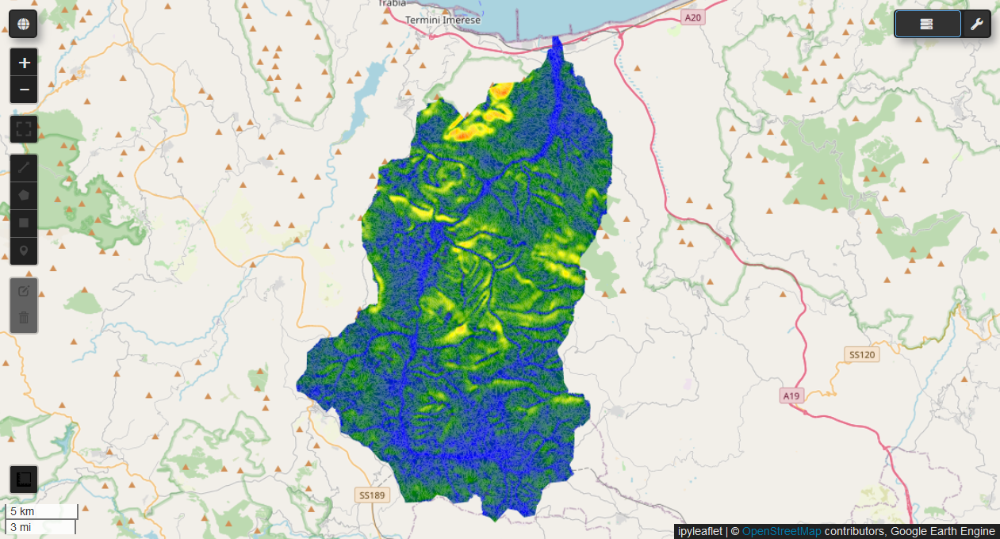
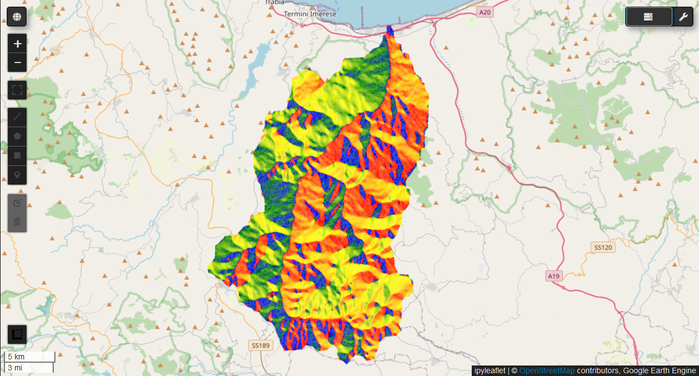
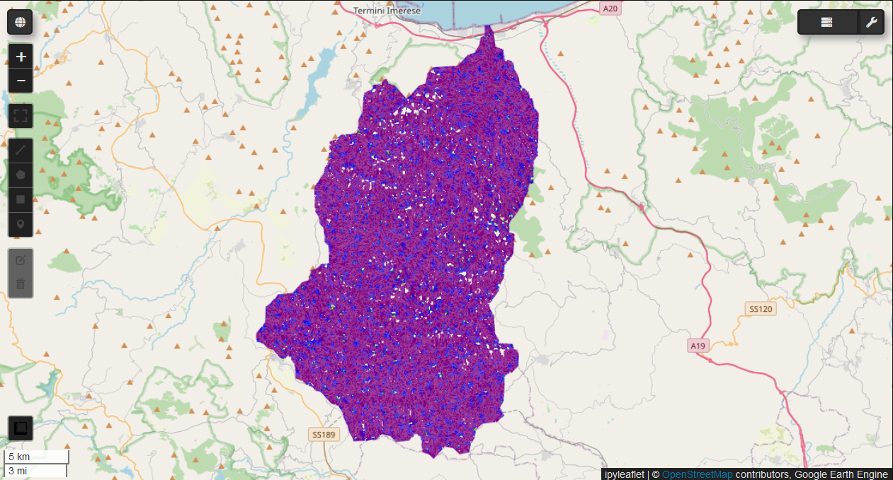

# Terrain Analysis with Google Earth Engine

This repository contains a Python script for terrain analysis using Google Earth Engine (GEE). It computes various terrain metrics over a specified FeatureCollection using a smoothed Digital Elevation Model (DEM).

## Overview

The script calculates morphometric factors such as elevation, slope, aspect, and curvature, essential for understanding landforms, hydrology, and ecological dynamics.

## Key Features

1. **Initialization of Google Earth Engine**  
   The script initializes the GEE API for geospatial processing.

2. **Smoothing the DEM**  
   A Gaussian filter is applied to the SRTM DEM to reduce noise and enhance terrain data quality.

3. **Loading FeatureCollection**  
   The script loads a FeatureCollection (SU2) for terrain metric calculations.

4. **Calculating Terrain Metrics**  
   The script computes the following terrain metrics:
   - **Elevation (El)**
   - **Slope (S)**
   - **Aspect (As)**
   - **Hillshade (Hill)**
   - **Northness (Nor)**
   - **Eastness (Eas)**
   - **Horizontal Curvature (HCv)**
   - **Vertical Curvature (VCv)**
   - **Mean Curvature (MeCur)**
   - **Minimal Curvature (MinCur)**
   - **Maximal Curvature (MaxCur)**
   - **Gaussian Curvature (Gauss)**
   - **Shape Index (Sh)**

5. **Calculating Statistics**  
   The mean and standard deviation of each terrain metric are computed for each feature in the FeatureCollection.

6. **Renaming Metrics**  
   Terrain metric bands are renamed for easier handling.

7. **Exporting Results**  
   The summarized data (mean and standard deviation) is exported as a GeoJSON file to Google Drive for further analysis in GIS software.

## Output

The output is a GeoJSON file containing the summarized terrain metrics for each feature in the FeatureCollection, with mean and standard deviation values for each metric.

## Usage

To use this script, ensure you have the following:

- Python 3.x installed.
- Google Earth Engine Python API set up.
- Access to Google Drive for exporting results.

## Screenshots

## Screenshots

| **TORTO Image**                | **Other Images**      |
|---------------------------------|-----------------------|
|              |    |
|              |  |
|              |  |

